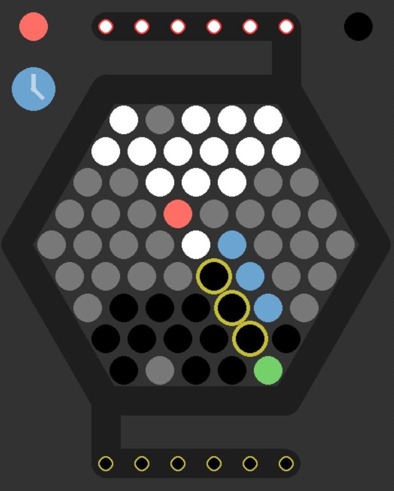

# Abalone Board Game Prototype

Welcome to my fully functional prototype of the classic board game Abalone.

## Prototype Features

- Accurately replicates the original Abalone game design and rules
- Pretty animations for piece moves, when pieces get knocked off and when the game ends
- Simply drag to highlight the piece(s) you want to move and the move options are displayed instantly in green(straight), blue(slide) and red(push).
- Option to play 2 player (top left of menu) or against a challenging AI (top right of menu)
- 61 levels that go green when completed, some have time restrictions or limited moves (bottom left of menu) (unfinished, only first 3 levels implemented)
- Sandbox mode so you can construct and analyse positions (bottom right of menu)
- Playing time of approximately 30 minutes but ability to set a move timer

## How to Play

1. Players choose a color and place their marbles on the designated starting positions on opposite sides of the board.
2. Players take turns moving their marbles. On a turn, a player can either:
   - Move a single marble to an adjacent empty space
   - Move a straight line of two or three marbles one space in any direction
   - Move a line of marbles to push an opposing line of fewer marbles off the board
3. The game ends when a player pushes six of the opponent's marbles off the board. The player who does this wins the game.

## the AI agent

The AI is made with a MiniMax approach with alpha-beta pruning and iterative deepening as well as some other optimisation techniques. The evaluation function considers metrics such as the distance to center and how compact the marbles are. More information on this is available in the document.

## Get Involved

If you're interested in learning more about this Abalone prototype or would like to provide feedback, please feel free to reach out. Your input is valuable in further improving and refining the game.

Thank you for checking out my Abalone board game prototype! Enjoy the strategic gameplay and the satisfying experience of pushing your opponent's marbles off the board.
